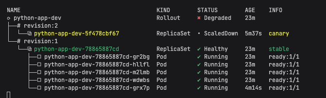

# Lab 14 — Progressive Delivery with Argo Rollouts

## 1. Argo Rollouts Setup

Argo Rollouts was installed in the cluster to extend the GitOps workflow from Lab 13 with progressive delivery capabilities.

### Controller installation

```bash
kubectl create namespace argo-rollouts
kubectl apply -n argo-rollouts -f https://github.com/argoproj/argo-rollouts/releases/latest/download/install.yaml
kubectl apply -n argo-rollouts -f https://github.com/argoproj/argo-rollouts/releases/latest/download/dashboard-install.yaml
kubectl get pods -n argo-rollouts
kubectl get svc -n argo-rollouts
```

Observed result:

```text
NAME                                      READY   STATUS    RESTARTS   AGE
argo-rollouts-5f64f8d68-bzgq6             1/1     Running   0          3m2s
argo-rollouts-dashboard-755bbc64c-j8lx4   1/1     Running   0          2m48s

NAME                      TYPE        CLUSTER-IP      EXTERNAL-IP   PORT(S)    AGE
argo-rollouts-dashboard   ClusterIP   10.105.145.45   <none>        3100/TCP   2m48s
argo-rollouts-metrics     ClusterIP   10.101.47.58    <none>        8090/TCP   3m3s
```

### kubectl plugin installation

```bash
brew install argoproj/tap/kubectl-argo-rollouts
kubectl argo rollouts version
```

Observed result:

```text
kubectl-argo-rollouts: v1.8.3+49fa151
BuildDate: 2025-06-04T22:19:21Z
Platform: darwin/amd64
```

### Dashboard access

```bash
kubectl port-forward svc/argo-rollouts-dashboard -n argo-rollouts 3100:3100
```

Dashboard URL:

```text
http://localhost:3100
```

---

## 2. Rollout vs Deployment

A standard Kubernetes `Deployment` supports rolling updates, but it does not provide native step-based canary releases, preview services for blue-green, or manual promote/abort commands.

Argo Rollouts introduces the `Rollout` CRD, which keeps the same general workload structure but adds:
- canary step definitions
- pause steps
- manual promotion
- abort / retry workflow
- blue-green active/preview service switching
- dashboard visualization of revisions and traffic progression

In this lab, the Helm chart from Lab 13 was updated so that:
- `Deployment` is disabled when rollout mode is enabled
- `Rollout` becomes the primary workload kind
- the `dev` environment uses **canary**
- the `prod` environment uses **blue-green**

---

## 3. Chart Changes

### Added files

```text
k8s/python-app/templates/rollout.yaml
k8s/python-app/templates/preview-service.yaml
k8s/ROLLOUTS.md
```

### Updated files

```text
k8s/python-app/templates/deployment.yaml
k8s/python-app/templates/service.yaml
k8s/python-app/templates/_helpers.tpl
k8s/python-app/values.yaml
k8s/python-app/values-dev.yaml
k8s/python-app/values-prod.yaml
```

### Strategy mapping

- `python-app-dev` in namespace `dev` → **canary rollout**
- `python-app-prod` in namespace `prod` → **blue-green rollout**

The `dev` rollout was configured with `replicaCount: 5` so that the 20/40/60/80 canary steps are meaningful and visible.

---

## 4. Canary Deployment (dev)

### Canary strategy configuration

The `dev` rollout uses the following canary sequence:
- 20% → manual pause
- 40% → pause 30s
- 60% → pause 30s
- 80% → pause 30s
- 100%

Example configuration from `values-dev.yaml`:

```yaml
rollout:
  enabled: true
  strategy: canary
  canary:
    steps:
      - setWeight: 20
      - pause: {}
      - setWeight: 40
      - pause:
          duration: 30s
      - setWeight: 60
      - pause:
          duration: 30s
      - setWeight: 80
      - pause:
          duration: 30s
      - setWeight: 100
```

### Initial rollout creation

After ArgoCD synchronized the updated chart, the old `Deployment` was pruned and replaced by a `Rollout`.

Observed state:

```text
Name:               argocd/python-app-dev
Sync Policy:        Automated (Prune)
Sync Status:        Synced to lab14
Health Status:      Healthy

Deployment             dev   python-app-dev   Succeeded   Pruned
Rollout                dev   python-app-dev   Synced      Healthy
```

Observed rollout resource:

```text
NAME             DESIRED   CURRENT   UP-TO-DATE   AVAILABLE   AGE
python-app-dev   5         5         5            5           2m7s
```

### Triggering a new canary revision

A new revision was triggered by changing the application version in `values-dev.yaml` and syncing the ArgoCD application.

The rollout was monitored with:

```bash
kubectl argo rollouts get rollout python-app-dev -n dev -w
```

### Manual pause at 20%

Observed rollout state:

```text
Status:          Paused
Message:         CanaryPauseStep
Step:            1/9
SetWeight:       20
ActualWeight:    20
Replicas:
  Desired:       5
  Current:       5
  Updated:       1
  Ready:         5
  Available:     5
```

This confirms that the canary rollout stopped at the first manual gate exactly as configured.

### Screenshot — canary paused at 20%



### Manual promotion

The rollout was promoted manually with:

```bash
kubectl argo rollouts promote python-app-dev -n dev
```

After promotion, the rollout continued to the next steps.

### Abort / rollback demonstration

During the canary rollout, abort behavior was tested.

Observed dashboard/CLI state showed:
- rollout became `Degraded`
- canary ReplicaSet was scaled down
- stable ReplicaSet remained healthy and serving traffic

This demonstrates rollback to the stable version during a progressive delivery flow.


### Canary conclusion

The following requirements were demonstrated:
- canary rollout resource working
- gradual traffic shifting configured
- first manual pause reached at 20%
- manual promotion executed
- abort behavior observed with rollback to stable

---

## 5. Blue-Green Deployment (prod)

### Blue-green strategy configuration

The `prod` rollout uses blue-green strategy with:
- active service = main production service
- preview service = separate test endpoint
- `autoPromotionEnabled: false`

Example configuration from `values-prod.yaml`:

```yaml
rollout:
  enabled: true
  strategy: blueGreen
  blueGreen:
    autoPromotionEnabled: false
    previewService:
      enabled: true
      type: ClusterIP
```

### Rollout migration in prod

After manual synchronization, the old `Deployment` was pruned and replaced by a `Rollout`.

Observed sync output included:

```text
Service                prod   python-app-prod-preview   Synced   Healthy   service created
Deployment             prod   python-app-prod           Succeeded Pruned    pruned
Rollout                prod   python-app-prod           Synced    Healthy   rollout created
```

This confirms that blue-green resources were created successfully.

### Preview service creation

The preview service was created with the name:

```text
python-app-prod-preview
```

### Accessing active and preview endpoints

Both services were accessed with port-forwarding:

```bash
kubectl port-forward svc/python-app-prod -n prod 8080:80
kubectl port-forward svc/python-app-prod-preview -n prod 8081:80
```

They were tested with:

```bash
curl http://127.0.0.1:8080/
curl http://127.0.0.1:8081/
```

Observed responses returned healthy application data successfully from both endpoints.

### Manual promotion

Promotion was executed with:

```bash
kubectl argo rollouts promote python-app-prod -n prod
```

Observed output:

```text
rollout 'python-app-prod' promoted
```

After promotion, the rollout remained healthy.


### Note on preview comparison

The preview and active endpoints both returned valid application responses. If a more explicit proof of version difference is required, an additional version bump can be performed later and captured before promotion.

### Blue-green conclusion

The following blue-green requirements were demonstrated:
- blue-green strategy configured
- preview service created
- preview endpoint accessible
- manual promotion command executed successfully
- rollout healthy after promotion

---

## 6. Strategy Comparison

| Aspect | Canary | Blue-Green |
|---|---|---|
| Traffic behavior | gradual shift by steps | instant active/preview switch |
| User exposure | partial during rollout | hidden behind preview until promotion |
| Rollback style | abort current rollout and keep stable version | switch traffic back to stable / previous active version |
| Resource usage | lower | higher during overlap |
| Best use case | gradual production exposure | explicit preview validation |

### Pros and cons

#### Canary
**Pros:**
- gradual exposure to users
- lower risk during rollout
- rollback possible before full promotion

**Cons:**
- takes more time to complete
- requires careful monitoring of intermediate states

#### Blue-Green
**Pros:**
- clean preview environment
- simple manual promotion
- fast switch after validation

**Cons:**
- requires duplicate resources during the transition
- preview and active must both be managed correctly

### Recommendation

- use **canary** when gradual exposure and controlled rollout are important
- use **blue-green** when preview validation and explicit cutover are more important

For this lab setup:
- `dev` is a good fit for canary
- `prod` is a good fit for blue-green

---

## 7. Useful CLI Commands

### Status and monitoring

```bash
kubectl argo rollouts get rollout python-app-dev -n dev -w
kubectl argo rollouts get rollout python-app-prod -n prod -w
kubectl get rollout -A
kubectl get svc -n prod
```

### Promotion and control

```bash
kubectl argo rollouts promote python-app-dev -n dev
kubectl argo rollouts abort python-app-dev -n dev
kubectl argo rollouts retry rollout python-app-dev -n dev
kubectl argo rollouts promote python-app-prod -n prod
```

### Port-forwarding

```bash
kubectl port-forward svc/argo-rollouts-dashboard -n argo-rollouts 3100:3100
kubectl port-forward svc/python-app-prod -n prod 8080:80
kubectl port-forward svc/python-app-prod-preview -n prod 8081:80
kubectl port-forward svc/argocd-server -n argocd 8080:443
```

### Troubleshooting

```bash
argocd app get python-app-dev --refresh
argocd app get python-app-prod --refresh
argocd app sync python-app-dev --prune
argocd app sync python-app-prod --prune
argocd app terminate-op python-app-prod
kubectl get deployment -n dev
kubectl get deployment -n prod
```

---

## 8. Screenshots Summary

Insert the following screenshots where appropriate:

1. Canary rollout paused at 20%
2. Canary abort / degraded state with stable ReplicaSet healthy
3. Blue-green rollout state in `prod`
4. Preview service / active vs preview comparison

---

## 9. Conclusion

In this lab, progressive delivery was implemented on top of the GitOps workflow from Lab 13.

Completed results:
- Argo Rollouts controller, dashboard, and CLI plugin were installed
- the Helm chart was converted from `Deployment` to `Rollout`
- canary rollout was implemented and tested in `dev`
- manual pause, promotion, and abort behavior were demonstrated for canary
- blue-green rollout was implemented in `prod`
- preview service was created and tested
- manual promotion in blue-green was executed successfully
- the behavior of canary and blue-green strategies was compared and documented

This provides a working foundation for progressive delivery without using the bonus automated analysis features.
